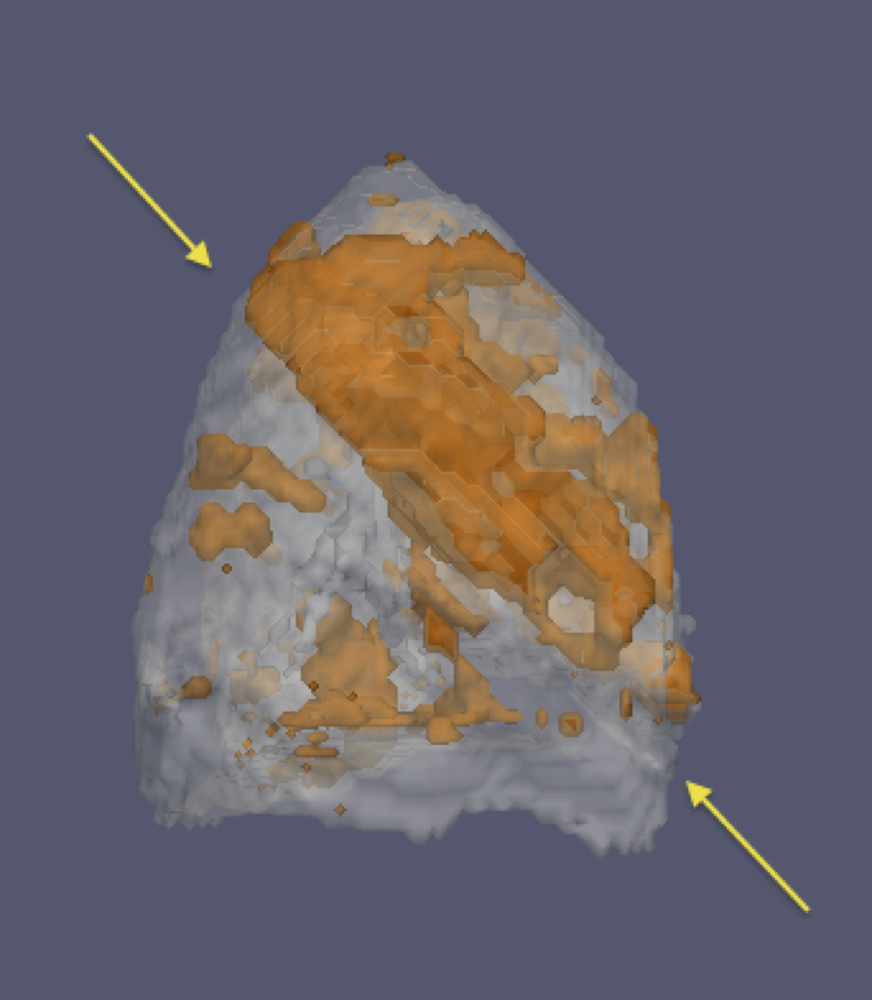

# Results

![Multivariate template construction using both 3He and 1H images. To create a normalized patient-specific space for statistical analysis of the longitudinal data, a template was created from the 3He and 1H data from each of the 5 time points. Aligned results are shown of the simultaneous acquisition by superimposing the faux color-rendered 3He image over the grayscale 1H image. The template was created iteratively wherein the algorithm alternated between averaging the registered images then registering each time point to the average image
(i.e., template estimate).](Figures/H1He3Template.png)

Eight patients completed the study. For every patient, a template was created from the 3He and 1H data from each of the 5 time points to provide a normalized patient-specific space for subsequent statistical analysis of the longitudinal data. The template construction algorithm described by Avants et al. [@Avants:2010aa] normally related to T1-weighted brain data, was applied to the pulmonary data. The simultaneous acquisition of the 3He and 1H MR images allowed multimodal processing [@Tustison:2015aa] in which both modalities were used to coordinate the data processing to simultaneously produce 3He and 1H templates. This process is illustrated in Figure 1 for a single patient. The alignment results of the simultaneous acquisition are shown by overlaying the faux color-rendered 3He image over the grayscale 1H image. The template was generated iteratively wherein the algorithm alternated between averaging the registered images then registering each time point to the average image (i.e., template estimate).

After N4 inhomogeneity correction was applied to each of the 5 time point image volumes, the individual corrected 3-D images from time points 2 through 5 were intensity normalized to the first time point. The 5 resulting corrected and normalized 3-D images were then collated into a single, 4-D spatio-temporal image, which was segmented using Atropos into 4 classes (Figure 2).

![Voxelwise regression analysis to determine image-based response to treatment. Treatment effects are expected to follow the simplified treatment hypothesis illustrated with the dashed blue line in the plot on the right. To explore how the longitudinal change in expected ventilation follows this treatment hypothesis with image data, the aligned expected ventilation maps were smoothed (to account for potential voxelwise misalignments), and regression of voxelwise intensities with the simplified treatment hypothesis was quantified.](Figures/correlation.png)

Following inhomogeneity correction and segmentation of the longitudinal image volumes for each of the 8 patients, expected ventilation image maps were created from the segmentation output using Equation 4. Images were then smoothed, as demonstrated in Figure 3, to account for any registration inaccuracies. A volumetric correlation map was generated for each of the 8 patients by identifying positively and negatively correlated regions satisfying $|r| \geq 0.5$ and $|EV_{3} - EV_{2}| \geq 0.1$, wherein $r$ is Pearson’s correlation coefficient, and $EV_{3}$ and $EV_{2}$ are the expected ventilation values at time points 3 and 2, respectively. In the relevant correlation map for each patient (Figure 4), orange and blue differentiate the positively and negatively correlated regions, respectively. Subsequent analyses included the calculation of positively and negatively correlated subvolumes in the template space (Table 1) to provide a global synthesis of the region-based quantities. Furthermore, regions of the lung that improved with treatment could be identified in a patient-specific manner. For example, in Figure 5, a view of the left lung of patient 3 can be seen, showing only positively correlated regions. The arrows designate the lobar fissure, revealing a predominant upper lobe treatment effect in this particular patient.

\input{table.tex}

